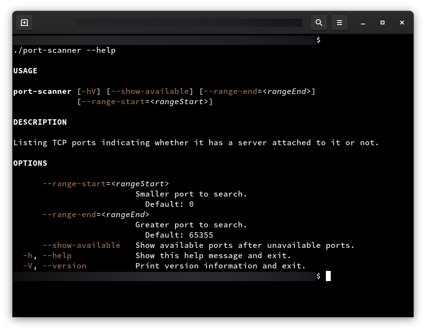

# POC: GraalVM Port Scanner

It demonstrates how to compile a Java console application to a standalone binary.

The goal is to implement a [console application](https://en.wikipedia.org/wiki/Console_application) that scans a range of [TCP ports](https://en.wikipedia.org/wiki/List_of_TCP_and_UDP_port_numbers#Well-known_ports) and informs which ports are being used. The user should be able to change the port range and the output using arguments and flags.

The application should also provide commands to print the version and the user manual formatted according to [ANSI specification](https://en.wikipedia.org/wiki/ANSI_escape_code).

## How to run

| Description | Command |
| :--- | :--- |
| Run tests | `./gradlew test` |
| Build application | `./gradlew nativeBuild` |
| Provision services | `./infra.sh provision` |
| Destroy services | `./infra.sh destroy` |

> Note: Commands to provision and destroy services are for manual testing only.

## Preview

Showing the report:


Showing the CLI manual:



Showing the CLI manual (text):

```
$ ./port-scanner --help

USAGE

port-scanner [-hV] [--show-available] [--range-end=<rangeEnd>]
             [--range-start=<rangeStart>]

DESCRIPTION

Listing TCP ports indicating whether it has a server attached to it or not.

OPTIONS

      --range-start=<rangeStart>
                         Smaller port to search.
                           Default: 0
      --range-end=<rangeEnd>
                         Greater port to search.
                           Default: 65355
      --show-available   Show available ports after unavailable ports.
  -h, --help             Show this help message and exit.
  -V, --version          Print version information and exit.
```

Showing the CLI file size:

```
$ ls -lh | grep port-scanner
-rwxr-xr-x  1 user user 17M jul 10 01:39 port-scanner
```

Showing the CLI version:

```shell
$ ./port-scanner --version
0.1.0
```

Scanning the default range of ports:

```
$ ./port-scanner
Scanning ports from 0 to 65355 ...

Unavailable ports:
	* 4000
	* 5000
	* 5678
	* 8081
	* 8082
```

Scanning a custom range of ports:

```
$ ./port-scanner --range-start=8070 --range-end=9000
Scanning ports from 8070 to 9000 ...

Unavailable ports:
	* 8081
	* 8082
```

Showing the available ports too:

```
$ ./port-scanner --range-start=8070 --range-end=8090 --show-available
Scanning ports from 8070 to 8090 ...

Unavailable ports:
	* 8081
	* 8082

Available ports:
	* 8070
	* 8071
	* 8072
	* 8073
	* 8074
	* 8075
	* 8076
	* 8077
	* 8078
	* 8079
	* 8080
	* 8083
	* 8084
	* 8085
	* 8086
	* 8087
	* 8088
	* 8089
	* 8090
```

